LeakingTower For OceanYo Co,Ltd. 12月3日 电

2022年11月30日，旧金山律所 Mitchell Silberberg & Knupp LLP (MSK) 代表米哈游（Hoyoverse）海外运营子公司 Cognosphere Pte. Ltd. 于美国加利福尼亚州北区联邦地区法院（旧金山）申请向 Discord 发送一张法院传票，要求 Discord 交出知名爆料者 Ubatcha#2791 的身份，包括姓名、地址、电话、电子邮箱，理由是 Ubatcha 在 Wangsheng Funeral Parlor Genshin Impact (WFP，中文为往生堂) 服务器发布了侵犯原神版权的内容。

2022年11月29日，Cognosphere 已经向 Discord 递交了一份 DMCA 通知，目标是 WFP 上的爆料内容。
在法律文件中能够看见 WFP, Sip Sip Squad, 往生堂(Plusle Leaks), Genshin 3DMigoto 等 Discord 服务器。

如下是法律文件局部图片：

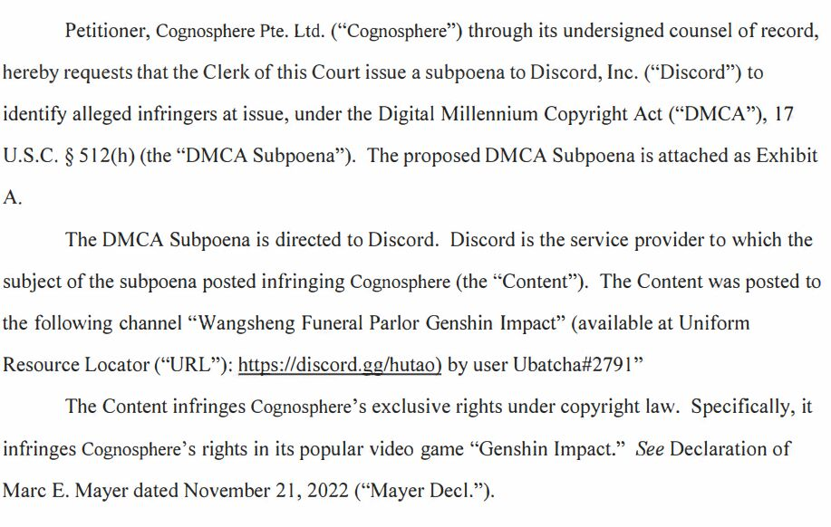
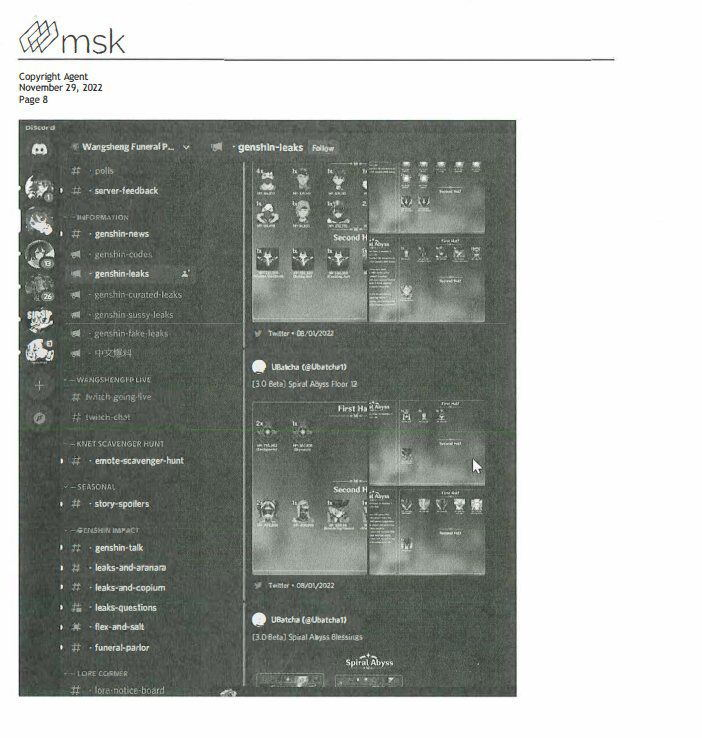
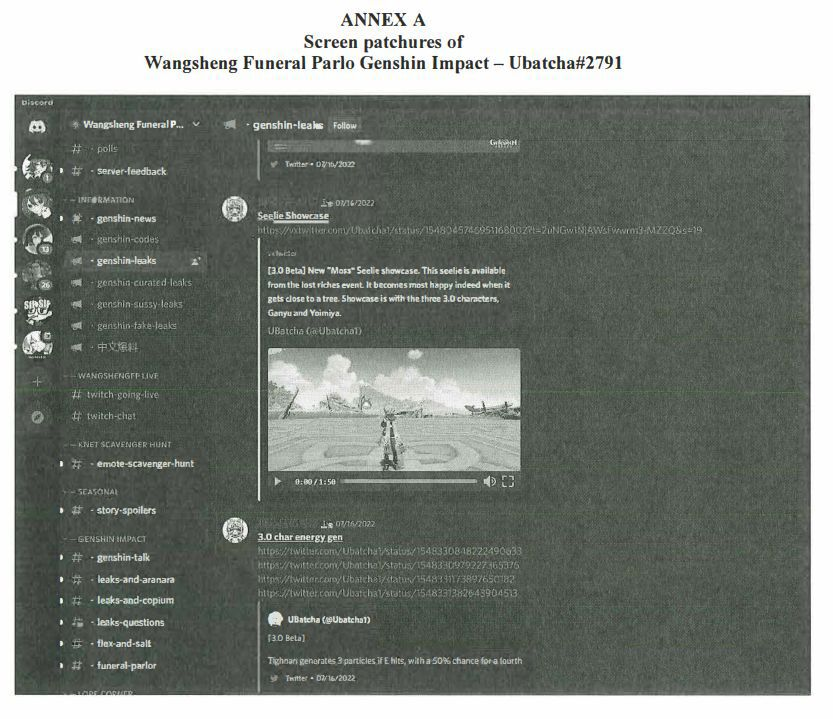
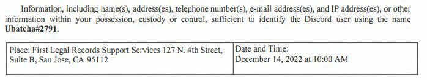

由于米哈游（Hoyoverse）已经开始通过法律手段来追查知名原神爆料者的身份，出于人身安全、维护成本、以及原神内部变化的考虑，https://projectcelestia.com 网站将被永久关闭，相关推特（Twitter）账号也将被停用。

DMCA 传票并不仅限于 Discord。米哈游随时可能开始追查推特上的爆料者们。Project Celestia 不想冒这个险。

下为 Project Celestia 发布的推文 5 则，发布后， 其注销了推特账号：

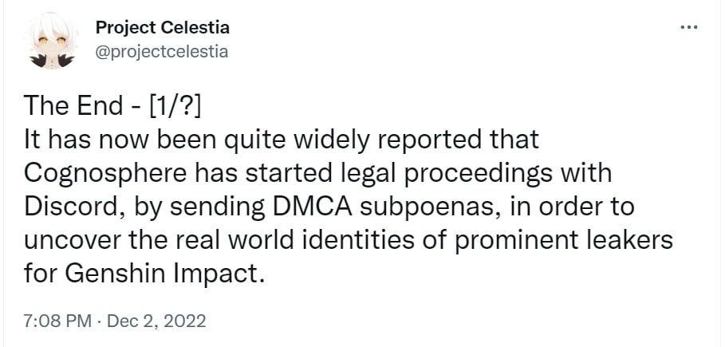
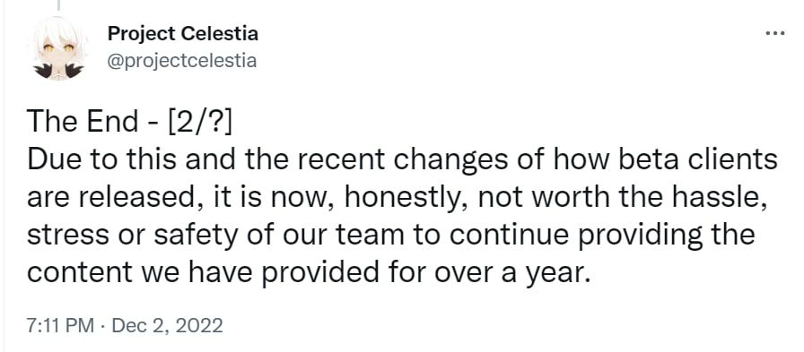
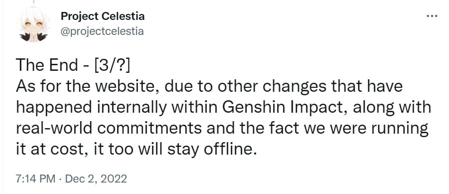
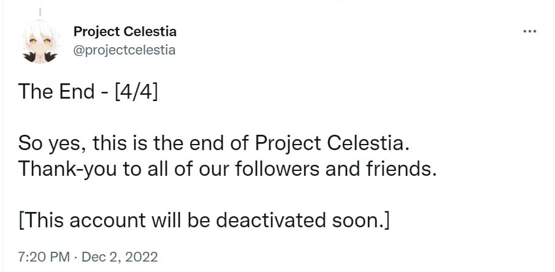
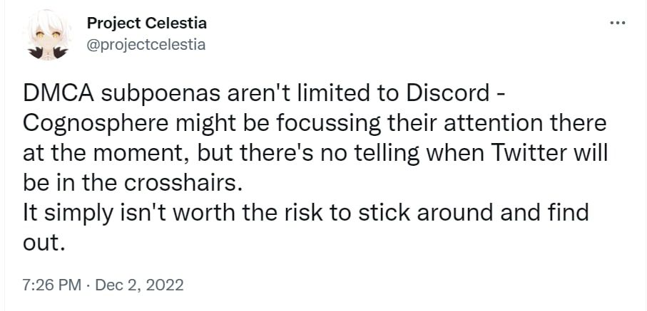

Blank 更改了自己的昵称、个人介绍等，发布了如下推文，并由此注销账号：

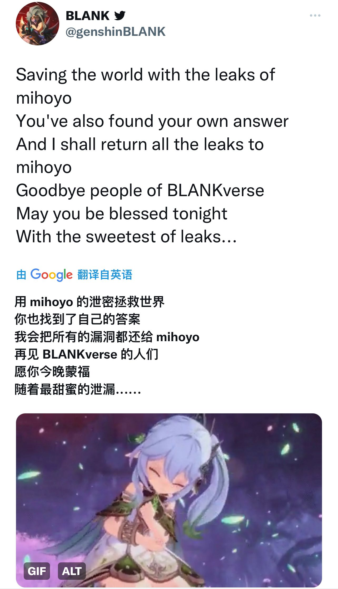

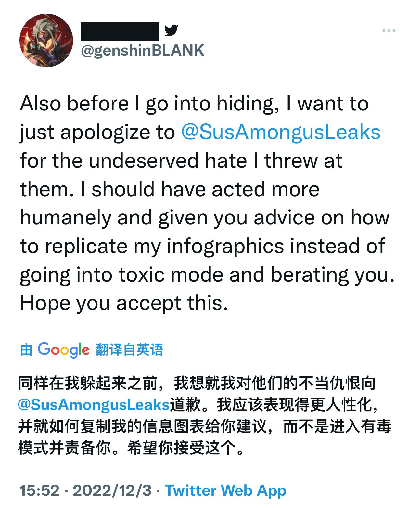
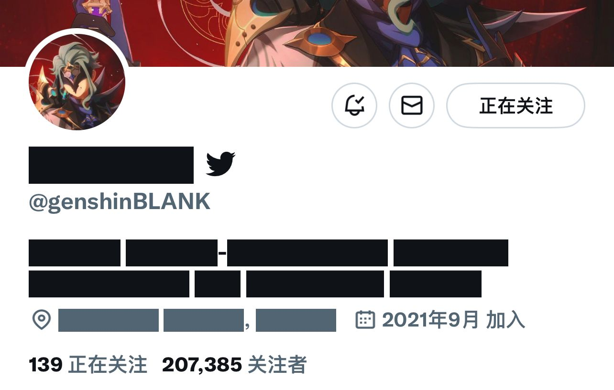

而其他爆料频道均开始躲避风头，如天理尝蛆暂时关闭了 Discord 的爆料频道；SYP 的 Discord 频道也宣布暂时隐藏原有的大部分爆料子频道，并准备调整频道。